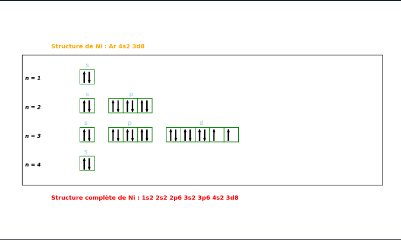

# Atomistique

## Description
Réalisation d’un projet durant ma première année de classe préparatoire, visant à développer un outil pédagogique interactif en Python pour visualiser les configurations électroniques des éléments chimiques. Utilisation de bibliothèques comme Matplotlib et NumPy pour créer des représentations graphiques et respecter les règles atomistiques fondamentales (remplissage orbital, valence, etc.). Une expérience enrichissante mêlant programmation et chimie théorique.

## Langages et outils utilisés

- **Python**

## Présentation du projet

Essentiellement, la fonction la plus importante du programme, "casesQuantiques", affiche un tableau montrant la disposition des électrons de valence dans les couches appropriées. L'architecture électronique est également écrite.

 
 
 
 

    
